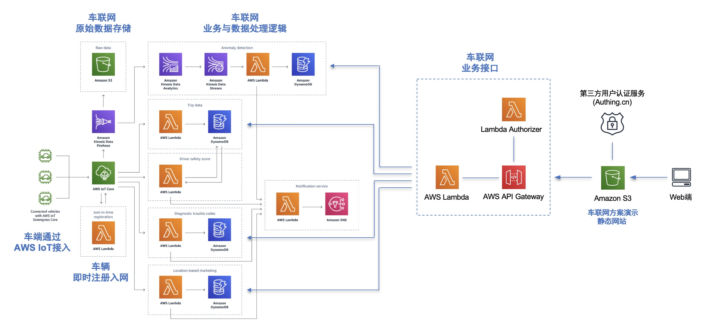
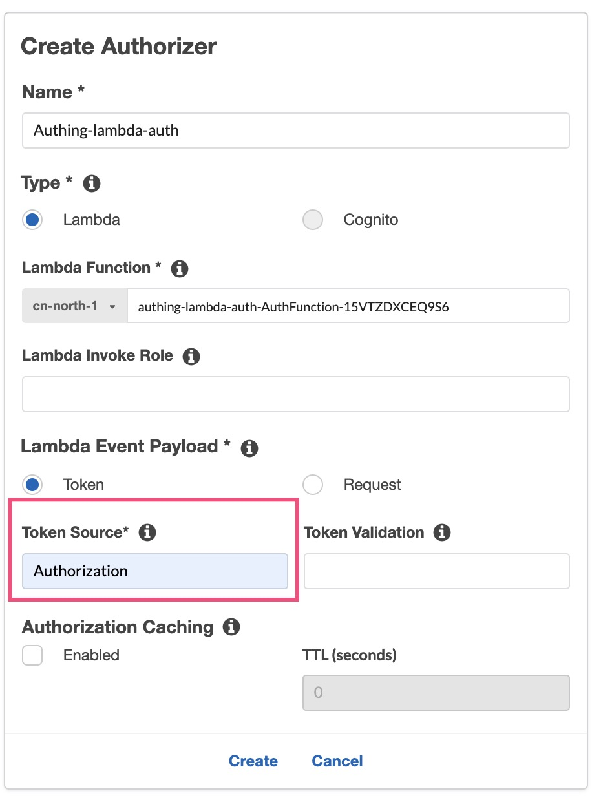
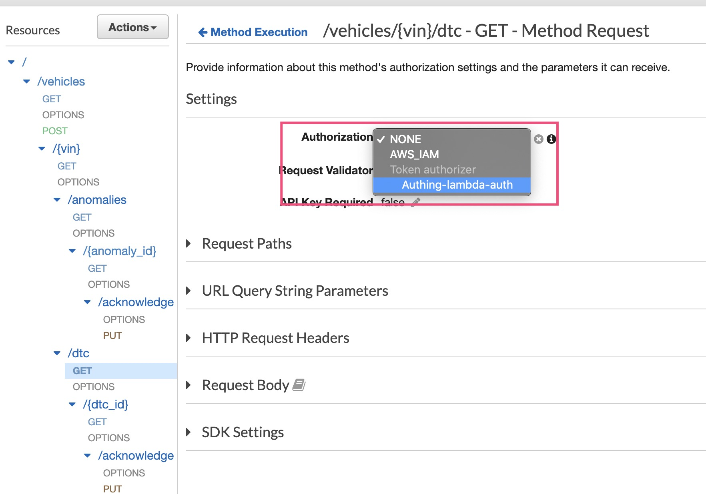
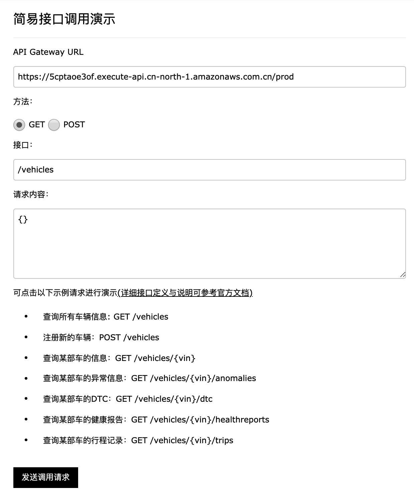
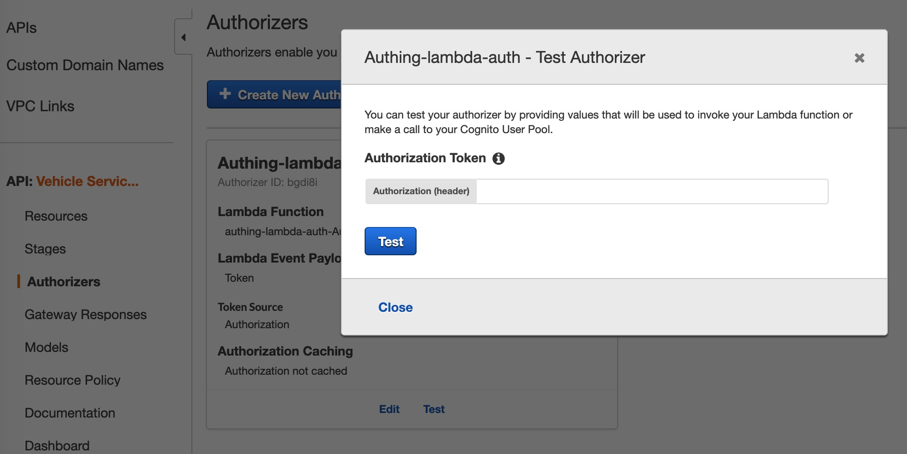
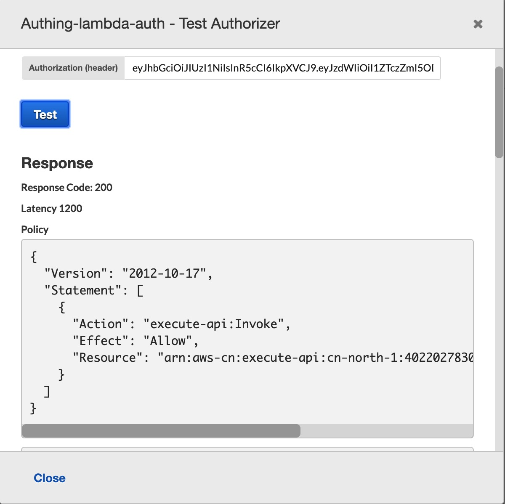

# AWS车联网解决方案: 基于AWS国内区域
简体中文 | [English](README.en.md)

[AWS Connected Vehicle Solution](https://aws.amazon.com/solutions/aws-connected-vehicle-solution/) 是车联网场景在AWS云上的参考实现。通过这个项目我们会把该解决方案迁移至AWS国内区域。由于该解决方案使用了一些国内区域暂时未上线的服务，如AWS Cognito和Kinesis Analytics等。在这个项目里我们会探索使用第三方服务或开源软件对这些服务进行替代。比如说，我们会演示如何使用 [Authing.cn](https://authing.cn) 来替换 Cognito User Pool 。注意到这个解决方案并不绑定于某些特定的第三方服务，使用 [Auth0](https://auth0.com) 或开源的 [Keycloak](www.keycloak.org) 等其他认证服务或方案也是可行的。

通过[官方文档](https://docs.aws.amazon.com/solutions/latest/connected-vehicle-solution/welcome.html)可以详细了解 AWS Connected Vehicle Solution的架构设计和和在AWS海外区域的部署方法。在这个项目里我们会提供该方案在AWS国内区域部署的架构和方法，同时提供一个托管在Amazon S3上的静态网站以方便进行车联网业务接口调用的演示和调试。

## 整体架构



解决方案如下几部分组成：
- 车辆端: 部署 AWS IoT SDK/Greengrass 接入 AWS IoT ，车辆可以通过 AWS IoT JITR 机制进行即时注册接入车辆网
- 车联网原始数据存储: 车端数据通过AWS IoT接入后转存入以S3为基础的数据湖进行存储和后续可能的大数据分析
- 车联网业务与数据处理逻辑：基于Serverless架构实现处理逻辑，如驾驶安全评分、行程、DTC和基于位置的市场营销等等
- 车联网业务接口：基于Serverless架构部署业务接口，并通过Lambda Authroizer与第三方认证服务进行集成
- 车联网API演示网站：托管在Amazon S3的静态网站，通过Web进行API调用的演示


## 部署方法

### 0. 整体思路

AWS Connected Vehicle Solution是通过一个Cloudformation模板一键就可以将相关的资源在AWS部署出来，由于在国内区域Cognito和Kinesis Analytics服务未上线，因此会先将原有Cloudformation模板中相关资源去除，得到一个可以在国内区域跑通的模板，然后再加入Lambda Authorizer对Token进行验证，并对API Gateway进行配置更新。

后续会将上述步骤重新整合在一个Cloudformation模板中，以实现在国内区域的一键部署。

### 1. 通过调整过的模板部署 Connected Vehicle Solution 

通过如下链接可以使用调整过的模板在北京区域部署 Connected Vehicle Solution 。后续项目代码稳定后会提供在宁夏区域进行部署

[](https://console.amazonaws.cn/cloudformation/home?region=cn-north-1#/stacks/quickcreate?templateUrl=https%3A%2F%2Flinjungz-cvra2cn-cn-north-1.s3.cn-north-1.amazonaws.com.cn%2Faws-connected-vehicle-solution-cn.template&stackName=CVRA2-cn)

在[这里](deployment/aws-connected-vehicle-solution-cn.template) 可以下载调整过的模板。如前面所提到，该模板部署的API Gateway没有认证机制，因此需要通过一个Lambda Authorizer来进行API的验证。

### 2. 为 API Gateway 部署 Lambda Authorizer 对接认证服务

在这个项目里我们提供了[Lambda代码](authing-lambda-auth/README.md)，可作为API Gateway的Lambda Authorizer，用来验证Authing认证通过后前端传过来的 [JWT](https://jwt.io/introduction/) 。该Lambda可以通过AWS Serverless开发部署工具 [SAM](https://aws.amazon.com/serverless/sam/) 来快速部署到国内区域。

由于Connected Vehicle Solution默认API Gateway是通过Cognito服务进行认证的，因此API Gateway后端的Lambda在代码中会从RequestContext获取Cognito用户名。为减少对现有这些Lambda代码的修改，Lambda Authorizer的输出会模拟出Cognito的相关信息，并在API Gateway后端Lambda进行一处代码修改(source/services/vehicle/lib/index.js 第62行)，以便正确获取到Authing的用户信息，并使得相关业务逻辑可以正常运行。

通过修改这个Lambda Authorizer，用户可以对接其他的认证服务如Auth0等。AWS官方文档提供了Lambda Authorizer的[示例代码](https://docs.aws.amazon.com/apigateway/latest/developerguide/apigateway-use-lambda-authorizer.html)。

#### 在 API Gateway 中配置 Lambda Authorizer

在AWS控制台中找到第一步创建的API ("Vehicle Services API"), 并[创建一个Lambda Authorizer](https://docs.aws.amazon.com/apigateway/latest/developerguide/configure-api-gateway-lambda-authorization-with-console.html)，选择刚才部署的Lambda函数，具体配置如下示：



修改API中每一个方法请求(Method Request), 启用 Lambda Authorizer: 



#### 创建Authing帐号和OIDC应用

参考关于 [Authing 配置](https://blog.csdn.net/chidongzhou7494/article/details/101003055) 和 [OIDC](https://authing.cn/blog/5-%E5%88%86%E9%92%9F%E7%90%86%E8%A7%A3%E4%BB%80%E4%B9%88%E6%98%AF-OIDC/) 的链接，创建Authing帐号和OIDC应用。

#### 修改 Lambda Authorizer 中使用的 OIDC APP Secret 

OIDC App Secret 保存在了 Lambda 函数的环境变量 authingOIDCAppSecret 中。

### 3. 测试车联网业务接口 (Vehicle Service API)

#### 通过演示网站进行接口调用测试

为方便进行接口调用演示，可部署本项目中附带的[演示网站](web-api-demo/README.md)。这是一个静态文件可直接托管在Amazon S3中，集成了Authing的登陆认证，获取token后直接在Web页面上可进行接口调用，方便接口的调试和演示。



#### 通过curl/Postman进行接口调用测试

通过演示网站页面上提供的Token，方便用户使用常用的Postman或curl工具来进行调试。如下是使用curl进行接口调用的演示：

- 通过Post请求注册新车辆
```shell
$ curl -d '{"vin":"vin2","nickname":"car2"}' -H "Content-Type: application/json" -H "Authorization:eyJhbGciOiJIUzI1NiIsInR5cCI6IkpXVCJ9.eyJzdWIiOi...Very...Long...Token...loqbEvh29E" -X POST https://5cptaoe3of.execute-api.cn-north-1.amazonaws.com.cn/prod/vehicles
```
返回结果:
```json
{"vin":"vin2","nickname":"car2","owner_id":"test"}%
```

- 通过Get请求获取该用户名下全部车辆信息

```shell
$ curl -H "Authorization:eyJhbGciOiJIUzI1NiIsInR5cCI6IkpXVCJ9.eyJzdWIiOiI1ZTczZmI5...Very...Long...Token...loqbEvh29E" https://5cptaoe3of.execute-api.cn-north-1.amazonaws.com.cn/prod/vehicles
```
返回结果:
```json
{"Items":[{"nickname":"car1","vin":"vin1","owner_id":"test"},{"nickname":"car2","vin":"vin2","owner_id":"test"}],"Count":2,"ScannedCount":2}%
```

#### 在 API Gateway 中校验 JWT 

通过演示网站页面上的Token，在 API Gateway 中对 Lambda Authorizer进行测试


如果token是合法的，Lambda Authorizer 会返回 200 与一个策略文档，以便使得API Gateway有权限执行后端的Lambda函数




***